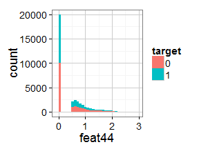
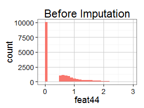
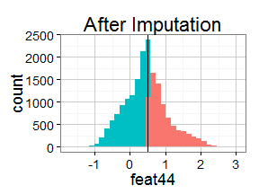

# STA 6714 Final Project

Author: Robert Norberg

Due: April 23, 2014

Date Ran: April 11, 2014

----


## Executive Summary (1 Page) 


## Data Preparation

### Exploration


All of the data is read in as either numeric or integer data, but some of the variables have low cardinality, suggesting they might be better treated as nominal or ordinal data. Several features had only one value (*feat47*, *feat48*, *feat49*, *feat50*, and *feat51*). Since these do not provide any information about the target, I deleted them. 


I decided to treat any variable with a cardinality of 2 as a nominal variable and those with a cardinality of 10 or less as an ordinal variable. 


The variables effected are summarized in the table below.

|    &nbsp;    |  Cardinality  |  Class  |
|:------------:|:-------------:|:-------:|
|  **feat4**   |       3       | Ordinal |
|  **feat8**   |       3       | Ordinal |
|  **feat12**  |       3       | Ordinal |
|  **feat17**  |       5       | Ordinal |
|  **feat29**  |       2       | Nominal |
|  **feat30**  |       2       | Nominal |
|  **feat31**  |       3       | Ordinal |
|  **feat35**  |       2       | Nominal |
|  **feat36**  |       2       | Nominal |
|  **feat43**  |       2       | Nominal |
|  **feat52**  |       2       | Nominal |
|  **feat55**  |       2       | Nominal |
|  **feat56**  |       3       | Ordinal |
|  **feat66**  |       3       | Ordinal |
|  **feat69**  |       3       | Ordinal |
|  **feat75**  |       3       | Ordinal |
|  **feat76**  |       4       | Ordinal |


I noticed several variables that had a very large number of 0 values. It seems that a 0 value has some special significance for many of the variables.

The percentage of zeros in each variable is presented in Appendix 1.


I suspect that many of the variables are censored and 0 is used to represent "greater than the detection limit" or "less than the detection limit" or something similar. Censored data is a common phenomenon in biological data. Survival analysis typically deals with right censored data because the lifespan of organisms still living at the end of the study period is partially unknown. Analysis of chemical concentrations often deals with left censored data because when the concentration of a chemical drops below a certain point the lab can no longer detect it. 

Take for example a plot of **feat44**. This looks like a classic case of left-censored data. 

 


I will treat these 0's as potentially missing data. 


### Missing Values Indicators and MVP


There are only 8 variables in the data set with truly missing data. Surprisingly there are only 8 patterns of missingness, suggesting the data are not missing at random. Indeed, those rows with missing values for **feat20** are also missing **feat21** and **feat22**. Similarly, **feat44**, **feat45**, and **feat46** are missing values in the same rows. A table summarizing missing values is presented in Appendix 1. Having a missing value indicator for each of the 8 variables with missing values would increase the number of predictors to be considered by 8. Using 7 dummy variables to represent the 8 missing value patterns will reduce that by one, so I choose to represent missingness in this manner.


### Missing Value Imputation 


  


The variables I consider possibly left censored are **feat10**, **feat34**, **feat44**, **feat46**, **feat59**, **feat60**, **feat65**, **feat73**, **feat77**

Those that are possibly right-censored are **feat26**, **feat27**, **feat28**, **feat45**, **feat53**, **feat54**, **feat61**, **feat67**, **feat78**, 

Some variables also look to be censored on both the left and right side. These are **feat3**, **feat68**, 

Others that may be censored in some other way are **feat11**, **feat13**, **feat14**, **feat15**, **feat20**, **feat21**, **feat37**, **feat38**, **feat39**, **feat40**, **feat41**, **feat42**, **feat62**, **feat63**, **feat72**, **feat74**


### Transformations 

### Outliers 

## Model Building

## Model Performance 

### Model performance evaluation 

#### ROC curve

#### c statistics

#### Validation Sum Squares

### Variable Importance 

### Variable Impact to the Target Variable 

## Conclusions 

-----

## Appendices

### Tables


|  Variable  |  % 0's  |
|:----------:|:-------:|
| exampleid  |   0%    |
|   target   |  50.3%  |
|   feat1    |  84.6%  |
|   feat2    |  87.2%  |
|   feat3    |  84.6%  |
|   feat4    |  84.6%  |
|   feat5    |  89.6%  |
|   feat6    |  91.8%  |
|   feat7    |  89.6%  |
|   feat8    |  89.6%  |
|   feat9    |  1.3%   |
|   feat10   |  9.3%   |
|   feat11   |  1.3%   |
|   feat12   |  1.3%   |
|   feat13   |   0%    |
|   feat14   |  1.8%   |
|   feat15   |  11.7%  |
|   feat16   |  48.4%  |
|   feat17   |  84.5%  |
|   feat18   |  84.5%  |
|   feat19   |   0%    |
|   feat20   |   N/A   |
|   feat21   |   N/A   |
|   feat22   |   N/A   |
|   feat23   |   0%    |
|   feat24   |  1.8%   |
|   feat25   |  11.7%  |
|   feat26   |  39.9%  |
|   feat27   |  39.9%  |
|   feat28   |  39.9%  |
|   feat29   |   N/A   |
|   feat30   |  59.9%  |
|   feat31   |  39.9%  |
|   feat32   |  56.1%  |
|   feat33   |  41.6%  |
|   feat34   |  39.9%  |
|   feat35   |  97.6%  |
|   feat36   |  97.7%  |
|   feat37   |  97.6%  |
|   feat38   |  97.6%  |
|   feat39   |  97.6%  |
|   feat40   |  97.6%  |
|   feat41   |  97.6%  |
|   feat42   |  97.6%  |
|   feat43   |  39.9%  |
|   feat44   |   N/A   |
|   feat45   |   N/A   |
|   feat46   |   N/A   |
|   feat52   |  62.8%  |
|   feat53   |  62.8%  |
|   feat54   |  62.8%  |
|   feat55   |   N/A   |
|   feat56   |  62.8%  |
|   feat57   |  73.1%  |
|   feat58   |   64%   |
|   feat59   |  62.8%  |
|   feat60   |  62.8%  |
|   feat61   |  62.8%  |
|   feat62   |  62.8%  |
|   feat63   |  71.9%  |
|   feat64   |  9.5%   |
|   feat65   |  9.5%   |
|   feat66   |  9.5%   |
|   feat67   |  9.5%   |
|   feat68   |  40.8%  |
|   feat69   |  40.8%  |
|   feat70   |  40.8%  |
|   feat71   |  40.8%  |
|   feat72   |  91.2%  |
|   feat73   |  92.2%  |
|   feat74   |  91.2%  |
|   feat75   |  91.2%  |
|   feat76   |  91.2%  |
|   feat77   |  91.2%  |
|   feat78   |  91.2%  |


|  Variable  |  % Missing  |
|:----------:|:-----------:|
|   feat20   |    68.4     |
|   feat21   |    68.4     |
|   feat22   |    68.4     |
|   feat29   |    60.12    |
|   feat44   |    28.94    |
|   feat45   |    28.94    |
|   feat46   |    28.94    |
|   feat55   |    37.2     |


### Works Cited

Lee L (2013). _NADA: Nondetects And Data Analysis for
environmental data_. R package version 1.5-6, <URL:
http://CRAN.R-project.org/package=NADA>.

Therneau TM (2014). _A Package for Survival Analysis in S_. R
package version 2.37-7, <URL:
http://CRAN.R-project.org/package=survival>.

Terry M. Therneau and Patricia M. Grambsch (2000). _Modeling
Survival Data: Extending the Cox Model_. Springer, New York. ISBN
0-387-98784-3.

R Core Team (2013). _R: A Language and Environment for Statistical
Computing_. R Foundation for Statistical Computing, Vienna,
Austria. <URL: http://www.R-project.org/>.

Dowle M, Short T, Srinivasan SLwcfA and Saporta R (2013).
_data.table: Extension of data.frame for fast indexing, fast
ordered joins, fast assignment, fast grouping and list columns._.
R package version 1.8.10, <URL:
http://CRAN.R-project.org/package=data.table>.

Wickham H (2009). _ggplot2: elegant graphics for data analysis_.
Springer New York. ISBN 978-0-387-98140-6, <URL:
http://had.co.nz/ggplot2/book>.

Dar<U+663C><U+3E33>czi G (2013). _pander: An R Pandoc Writer_. R
package version 0.3.8, <URL:
http://cran.r-project.org/package=pander>.

Andrew A, Zvoleff A, Diggs B, Pereira C, Wickham H, Jeon H, Arnold
J, Stephens J, Hester J, Cheng J, Keane J, Allaire J, Toloe J,
Takahashi K, Kuhlmann M, Caballero N, Salkowski N, Ross N,
Vaidyanathan R, Cotton R, Francois R, Brouwer S, Bernard Sd, Wei
T, Lamadon T, Torsney-Weir T, Davis T, Zhu W, Wu W and Xie Y
(2013). _knitr: A general-purpose package for dynamic report
generation in R_. R package version 1.5, <URL:
http://yihui.name/knitr/>.

Xie Y (2013). _Dynamic Documents with R and knitr_. Chapman and
Hall/CRC. ISBN 978-1482203530, <URL: http://yihui.name/knitr/>.

Xie Y (2013). "knitr: A Comprehensive Tool for Reproducible
Research in R." In Stodden V, Leisch F and Peng RD (eds.),
_Implementing Reproducible Computational Research_. Chapman and
Hall/CRC. ISBN 978-1466561595, <URL:
http://www.crcpress.com/product/isbn/9781466561595>.

R Core Team (2013). _R: A Language and Environment for Statistical
Computing_. R Foundation for Statistical Computing, Vienna,
Austria. <URL: http://www.R-project.org/>.

R Core Team (2013). _R: A Language and Environment for Statistical
Computing_. R Foundation for Statistical Computing, Vienna,
Austria. <URL: http://www.R-project.org/>.

R Core Team (2013). _R: A Language and Environment for Statistical
Computing_. R Foundation for Statistical Computing, Vienna,
Austria. <URL: http://www.R-project.org/>.

R Core Team (2013). _R: A Language and Environment for Statistical
Computing_. R Foundation for Statistical Computing, Vienna,
Austria. <URL: http://www.R-project.org/>.

R Core Team (2013). _R: A Language and Environment for Statistical
Computing_. R Foundation for Statistical Computing, Vienna,
Austria. <URL: http://www.R-project.org/>.

R Core Team (2013). _R: A Language and Environment for Statistical
Computing_. R Foundation for Statistical Computing, Vienna,
Austria. <URL: http://www.R-project.org/>.

R Core Team (2013). _R: A Language and Environment for Statistical
Computing_. R Foundation for Statistical Computing, Vienna,
Austria. <URL: http://www.R-project.org/>.


-----

### R code


```r
# Clear working environment
rm(list = ls())

# Options for document compilation
opts_chunk$set(echo = FALSE, warning = FALSE, message = FALSE, comment = NA, 
    fig.height = 3, fig.width = 4, fig.cap = "", results = "hide")

# Set table options for neat tables
library(pander)
panderOptions("table.split.table", 120)
panderOptions("table.split.cells", 30)
panderOptions("table.style", "rmarkdown")

# Globally set plot parameters
library(ggplot2)
theme_set(theme_bw(base_size = 18))
theme_update(panel.grid.major = element_line(colour = "#CCCCCC", size = 0.3), 
    panel.grid.minor = element_line(colour = "grey96", size = 0.7))

library(data.table)
train <- fread("C:/Users/Robert/cloud/Classes/Data Prep/Final Project/Data/WANGphy_train.csv")
zerotable <- fread("C:/Users/Robert/cloud/Classes/Data Prep/Final Project/Percent Zeros.csv")
zerotable <- zerotable[, `:=`(x, paste0(x, "%"))]
zerotable <- zerotable[x == "NA%", `:=`(x, "N/A")]
setnames(zerotable, c("Variable", "% 0's"))
pander(zerotable)
misstable <- fread("C:/Users/Robert/cloud/Classes/Data Prep/Final Project/Percent Missing.csv")
setnames(misstable, c("Variable", "% Missing"))
pander(misstable)
# Create bibliography to cite packages used
allLibs <- .packages()
library(knitcitations)
write.bib(allLibs, file = "Appendix.bib")
read.bib("Appendix.bib")
unique(sapply(train, class))  # all variables are either numeric or integer

mylengths <- sapply(train, function(x) length(unique(x)))
mylengths[mylengths < 20]
train[, `:=`(feat47, NULL)]
train[, `:=`(feat48, NULL)]
train[, `:=`(feat49, NULL)]
train[, `:=`(feat50, NULL)]
train[, `:=`(feat51, NULL)]
train[, `:=`(target, factor(target))]
train[, `:=`(feat4, ordered(feat4))]
train[, `:=`(feat8, ordered(feat8))]
train[, `:=`(feat12, ordered(feat12))]
train[, `:=`(feat16, ordered(feat16))]
train[, `:=`(feat17, ordered(feat17))]
train[, `:=`(feat29, factor(feat29))]
train[, `:=`(feat30, factor(feat30))]
train[, `:=`(feat31, ordered(feat31))]
train[, `:=`(feat35, factor(feat35))]
train[, `:=`(feat36, factor(feat36))]
train[, `:=`(feat43, factor(feat43))]
train[, `:=`(feat52, factor(feat52))]
train[, `:=`(feat55, factor(feat55))]
train[, `:=`(feat56, ordered(feat56))]
train[, `:=`(feat66, ordered(feat66))]
train[, `:=`(feat69, ordered(feat69))]
train[, `:=`(feat75, ordered(feat75))]
train[, `:=`(feat76, ordered(feat76))]
mylengths <- sapply(train, function(x) length(unique(x)))

varsEffected <- names(train)[mylengths < 10]
varsEffected <- varsEffected[varsEffected != "target"]

mytable <- data.frame(Cardinality = mylengths[varsEffected])
mytable$Class <- with(mytable, ifelse(Cardinality == 2, "Nominal", "Ordinal"))
library(pander)
pander(mytable, style = "rmarkdown")
myzeros <- round(sapply(train, function(x) 100 * sum(x == 0)/length(x)), 1)
write.csv(myzeros, file = "C:/Users/Robert/cloud/Classes/Data Prep/Final Project/Percent Zeros.csv")
ggplot(train, aes(x = feat44, fill = target)) + geom_bar()
mymissing <- sapply(train, function(x) 100 * sum(is.na(x))/length(x))  # only 8 variables with missing
mymissing <- mymissing[mymissing > 0]
write.csv(mymissing, file = "C:/Users/Robert/cloud/Classes/Data Prep/Final Project/Percent Missing.csv")
# create missing value indicators
train[, `:=`(Mfeat20, as.numeric(is.na(feat20)))]
train[, `:=`(Mfeat29, as.numeric(is.na(feat29)))]
train[, `:=`(Mfeat44, as.numeric(is.na(feat44)))]
train[, `:=`(Mfeat55, as.numeric(is.na(feat55)))]

train$MVP <- factor(with(train, paste0(Mfeat20, Mfeat29, Mfeat44, Mfeat55)))

train[, `:=`(Mfeat20, NULL)]
train[, `:=`(Mfeat29, NULL)]
train[, `:=`(Mfeat44, NULL)]
train[, `:=`(Mfeat55, NULL)]
# take only those where target=1
tmp <- train[target == 0 & !is.na(feat44), list(exampleid, target, feat44)]
ggplot(tmp, aes(x = feat44, fill = target)) + geom_bar() + ggtitle("Before Imputation") + 
    guides(fill = F)

library(NADA)
test <- cenfit(obs = tmp[, feat44], censored = tmp[, feat44 == 0])
mymean <- mean(test)["mean"]  # estimated mean
mymin <- tmp[feat44 != 0, min(feat44)]  # min with 0's removed
mydiff <- abs(mymean - mymin)  # mean - min
myn <- sum(tmp$feat44 == 0)  # how many values to bootstrap
mysamp <- sample(tmp[feat44 >= (mymean + mydiff), feat44], myn, replace = T)  # sample the right side of my distribution
myimp <- mymean - abs(mymean - mysamp)  # flip sample values over the mean
tmp[, `:=`(Ifeat44, F)]
tmp[feat44 == 0, `:=`(Ifeat44, T)]  # mark those I am about to replace with imputed values
tmp[feat44 == 0, `:=`(feat44, myimp)]  # replace 0's with values

ggplot(tmp, aes(x = feat44, fill = Ifeat44)) + geom_bar() + geom_vline(xintercept = mymin) + 
    ggtitle("After Imputation") + guides(fill = F)
```

